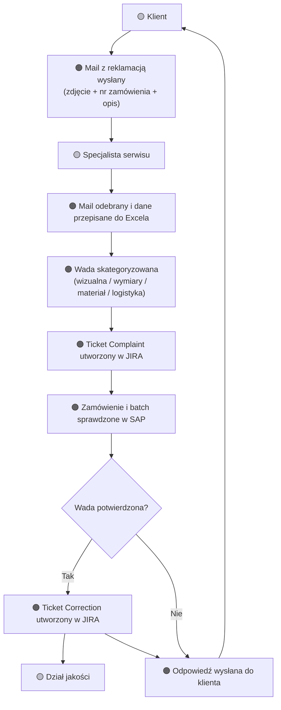

# Event Storming: Proces reklamacji AS-IS

**Legenda:**
- 🟠 Zdarzenie domenowe
- 🟡 Aktor

---

```mermaid
flowchart TD
    A1["🟡 Klient"]
    A2["🟡 Specjalista serwisu"]
    A3["🟡 Dział jakości"]

    E1["🟠 Mail z reklamacją wysłany\n(zdjęcie + nr zamówienia + opis)"]
    E2["🟠 Mail odebrany i dane przepisane do Excela"]
    E3["🟠 Wada skategoryzowana\n(wizualna / wymiary / materiał / logistyka)"]
    E4["🟠 Ticket Complaint utworzony w JIRA"]
    E5["🟠 Zamówienie i batch sprawdzone w SAP"]
    E6{"Wada potwierdzona?"}
    E7["🟠 Odpowiedź wysłana do klienta"]
    E8["🟠 Ticket Correction utworzony w JIRA"]

    A1 --> E1
    E1 --> A2
    A2 --> E2
    E2 --> E3
    E3 --> E4
    E4 --> E5
    E5 --> E6
    E6 -->|Tak| E8
    E8 --> A3   
    E8 --> E7    
    E6 -->|Nie| E7
    E7 --> A1

```
