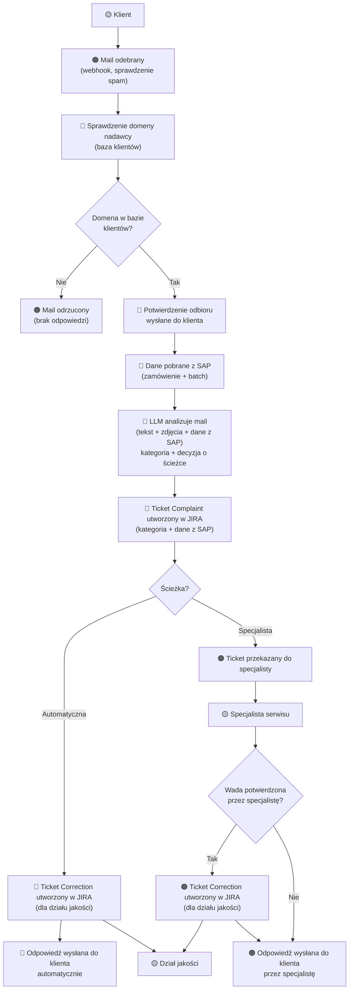

# Event Storming: Proces reklamacji TO-BE

**Legenda:**
- 🟠 Zdarzenie domenowe
- 🟡 Aktor
- 🤖 System / automatyzacja

---

```mermaid
flowchart TD
    A1["🟡 Klient"]
    A2["🟡 Specjalista serwisu"]
    A3["🟡 Dział jakości"]

    E1["🟠 Mail odebrany\n(webhook, sprawdzenie spam)"]
    E2["🤖 Sprawdzenie domeny nadawcy\n(baza klientów)"]
    E3{"Domena w bazie\nklientów?"}
    E4["🟠 Mail odrzucony\n(brak odpowiedzi)"]
    E5["🤖 Potwierdzenie odbioru\nwysłane do klienta"]
    E6["🤖 Dane pobrane z SAP\n(zamówienie + batch)"]
    E7["🤖 LLM analizuje mail\n(tekst + zdjęcia + dane z SAP)\nkategoria + decyzja o ścieżce"]
    E8["🤖 Ticket Complaint utworzony w JIRA\n(kategoria + dane z SAP)"]
    E9{"Ścieżka?"}
    E10["🤖 Ticket Correction utworzony w JIRA\n(dla działu jakości)"]
    E11["🤖 Odpowiedź wysłana do klienta\nautomatycznie"]
    E12["🟠 Ticket przekazany do specjalisty"]
    E13{"Wada potwierdzona\nprzez specjalistę?"}
    E14["🟠 Ticket Correction utworzony w JIRA\n(dla działu jakości)"]
    E15["🟠 Odpowiedź wysłana do klienta\nprzez specjalistę"]

    A1 --> E1
    E1 --> E2
    E2 --> E3
    E3 -->|Nie| E4
    E3 -->|Tak| E5
    E5 --> E6
    E6 --> E7
    E7 --> E8
    E8 --> E9
    E9 -->|Automatyczna| E10
    E10 --> E11
    E10 --> A3

    E9 -->|Specjalista| E12
    E12 --> A2
    A2 --> E13
    E13 -->|Tak| E14
    E14 --> A3
    E14 --> E15
    E13 -->|Nie| E15
```
