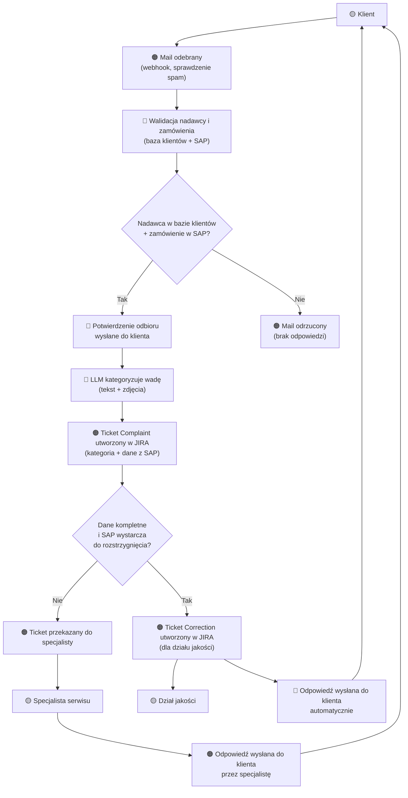

```mermaid
flowchart TD
    A1["🟡 Klient"]
    A2["🟡 Specjalista serwisu"]
    A3["🟡 Dział jakości"]

    E1["🟠 Mail odebrany\n(webhook, sprawdzenie spam)"]
    E1B["🤖 Walidacja nadawcy i zamówienia\n(baza klientów + SAP)"]
    E2{"Nadawca w bazie klientów\n+ zamówienie w SAP?"}
    E3["🤖 Potwierdzenie odbioru\nwysłane do klienta"]
    E6["🤖 LLM kategoryzuje wadę\n(tekst + zdjęcia)"]
    E8["🟠 Ticket Complaint utworzony w JIRA\n(kategoria + dane z SAP)"]
    E9{"Dane kompletne\ni SAP wystarcza\ndo rozstrzygnięcia?"}
    E10["🟠 Ticket Correction utworzony w JIRA\n(dla działu jakości)"]
    E11["🤖 Odpowiedź wysłana do klienta\nautomatycznie"]
    E12["🟠 Ticket przekazany do specjalisty"]
    E13["🟠 Odpowiedź wysłana do klienta\nprzez specjalistę"]
    E14["🟠 Mail odrzucony\n(brak odpowiedzi)"]

    A1 --> E1
    E1 --> E1B
    E1B --> E2
    E2 -->|Nie| E14
    E2 -->|Tak| E3
    E3 --> E6
    E6 --> E8
    E8 --> E9
    E9 -->|Tak| E10
    E10 --> A3
    E10 --> E11
    E11 --> A1
    E9 -->|Nie| E12
    E12 --> A2
    A2 --> E13
    E13 --> A1
```
